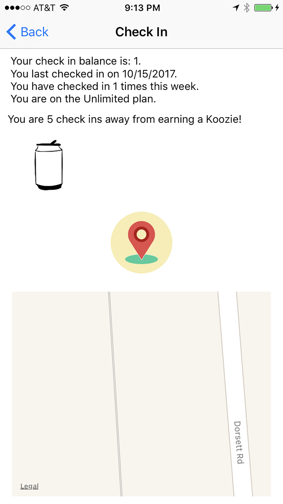
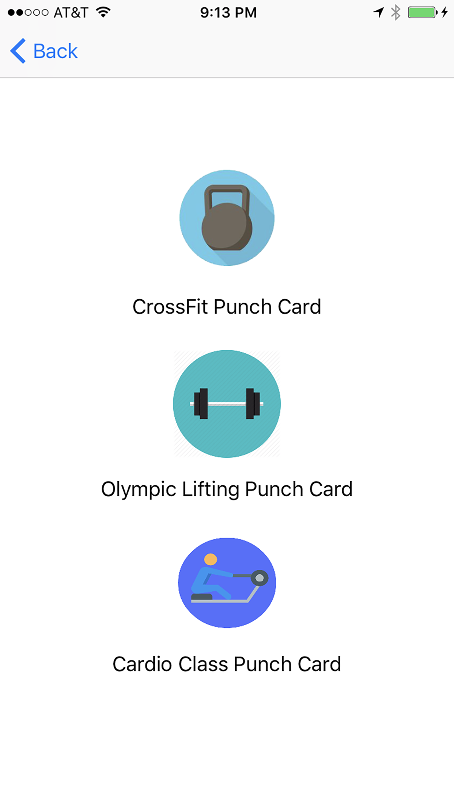
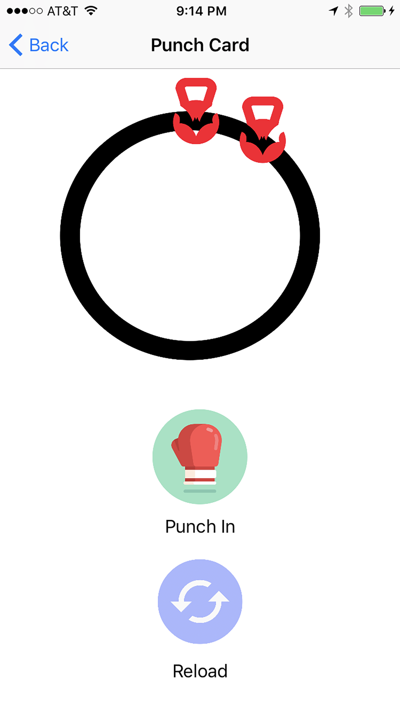
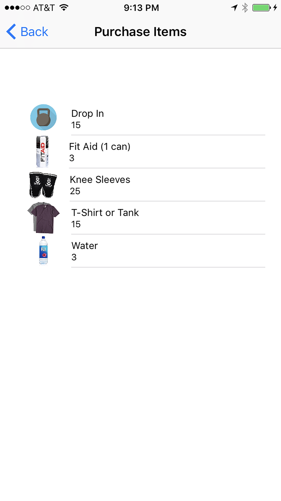

# SwiftBatCityCrossFitApp
# Android-Studio-Java-Bat-City-CrossFit-member-app

An Android Java app made for Bat City CrossFit that is integrated with Google Firebase, uses a QR code reader and GPS location,  
has basic chat features, and gym member statistics. 
It keeps track of class size, who is in a class and when did they checked in. 
It also has a feature to keep track of in gym purchases.
There are also three punch card features.

When you click on the icon on this screen, the camera will be launched ready to look for a QR code. 
The QR code references the dynamic value in a firebase table. If the two values match, it will issue a successful check in.
The app also records the user's physical address. This can be used later to determine if the user has tried to spoof their check in.

This portion doesn't actually process any credit cards. It just stores it in a Firebase table where the admin can manually charge the users for their in gym purchase.

The app hosts 3 types of punch cards separately. 

Clicking on the punch icon issues a short vibration and then an icon is added to the ring. From this screen you can also recharge your card when it runs out.
